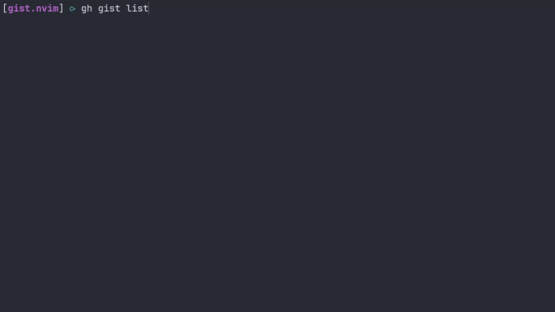

# gist.nvim


`gist.nvim` is a Neovim plugin that allows you to create a GitHub Gist from the current file.
The plugin uses the [`gh` command-line tool](https://cli.github.com/) to create the Gist and provides a simple interface for specifying the Gist's description and privacy settings.

## Installation

To use `gist.nvim`, you need to have Neovim installed on your system.
You also need to have the `gh` command-line tool installed and configured with your GitHub account.

If you intend to use the `GistsList` command to list and edit all your gists, I suggest the `nvim-unception` plugin.


Once you have Neovim and gh installed, you can install `gist.nvim` using your favorite plugin manager.

#### Using [lazy.nvim](https://github.com/folke/lazy.nvim):
```lua
return {
  {
    "Rawnly/gist.nvim",
    cmd = { "GistCreate", "GistCreateFromFile", "GistsList" },
    config = true
  },
  -- `GistsList` opens the selected gif in a terminal buffer,
  -- nvim-unception uses neovim remote rpc functionality to open the gist in an actual buffer
  -- and prevents neovim buffer inception
  {
    "samjwill/nvim-unception",
    lazy = false,
    init = function() vim.g.unception_block_while_host_edits = true end
  }
}
```
#### Using [packer.nvim](https://github.com/wbthomason/packer.nvim):
```lua
use {
  "rawnly/gist.nvim",
  config = function() require("gist").setup() end,
  -- `GistsList` opens the selected gif in a terminal buffer,
  -- this plugin uses neovim remote rpc functionality to open the gist in an actual buffer and not have buffer inception
  requires = { "samjwill/nvim-unception", setup = function() vim.g.unception_block_while_host_edits = true end }
}
```

## Usage

To create a Gist from the current file, use the `:GistCreate` command in Neovim.
The plugin will prompt you for a description and whether the Gist should be private or public.

```vim
  :GistCreate [description] [public=true]
```

- `:GistCreate` will create the gist from the current selection
- `:GistCreateFromFile` will create the gist from the current file

Both the commands accept the same options which are `[description=]` and `[public=true]`

If you don't pass the `description` it will prompt to insert one later.
If you pass `[public=true]` it won't prompt for privacy later.

After you enter the description and privacy settings, the plugin ask for confirmation and will create the Gist using the gh command-line tool and copy the Gist's URL to the given clipboard registry.

You can also list your gists and edit their files on the fly.
```vim
    :GistsList
```
- `:GistsList` will list all your gists and after you select one it will open a buffer to edit it
  - The default editor for modifying gists is configured as part of the gh cli usually in `~/.config/gh/config.yaml' or the system default

## Configuration

`gist.nvim` provides a few configuration options that you can with the `setup` function:

```lua
    require("gist").setup({
        private = false, -- All gists will be private, you won't be prompted again
        clipboard = "+", -- The registry to use for copying the Gist URL
        list = {
            -- If there are multiple files in a gist you can scroll them,
            -- with vim-like bindings n/p next previous
            mappings = {
                next_file = "<C-n>",
                prev_file = "<C-p>"
            }
        }
    })
```

## License

`gist.nvim` is released under MIT License. See [LICENSE](/LICENSE.md) for details.

## Contributing

If you find a bug or would like to contribute to `gist.nvim`, please open an issue or a pull request.
All contributions are welcome and appreciated!
